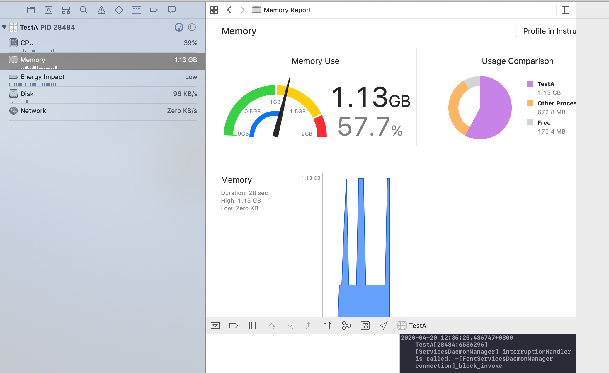
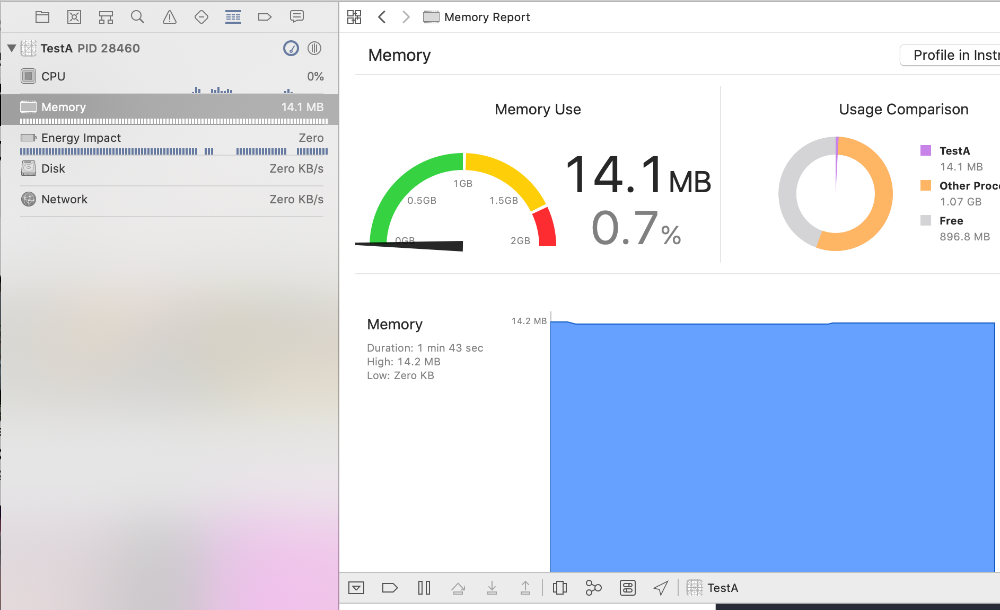

# DrawRectTest
验证drawRect耗内存情形分析

#### 运行工程，里面有两个测试方法

```
//[self lowMemoryCanvas];		// 测试消耗内存低的绘图方式,通过CAShapLayer实现
	[self highMemoryCanvas];	// 测试消耗内存高的绘图方式， 内部实现drawRect:
```


#### 对比图：

##### 高内存消耗




##### 低内存消耗




#### drawRect:消耗内存高的缘由

在每一个UIView的实例中，都有一个默认的支持图层，UIView负责创建并管理这个图层。实际上这个CALayer图层才是真正用来在屏幕上现实的，UIView仅仅是对它的一层封装。


CALayer其实也只是iOS中一个普通的类，它并不能直接渲染到屏幕上，因为屏幕上看到的东西，其实都是一张张图片。

那为什么我们能看到CALayer的内容呢？，因为CALayer内部有一个contents属性。这个属性可以传入一个id类型的对象，但只有你传CGImage的时候，它才能够正常显示在屏幕上。

即：UIView->CALayer->contents


contents也被称为__寄宿图__，除了给它赋值CGImage之外，我们也可以直接对它进行绘制，绘制的方法就是通过以下两种任意一种方法：

```
UIView的 drawRect:
CALayer的 drawLayer:inContext:
```

对于UIView来说，寄宿图并不是必须的，UIView不关心绘制的内容。如果UIView检测到drawRect方法实现了，它就会为视图分配一个寄宿图，这个__寄宿图的像素尺寸等于视图大小*contentScale__

当使用`[self highMemoryCanvas];`方法时，内部的`drawRect`会生成一个寄宿图（及时里面没实现任何方法），生成内存大小为：__图层宽*图层高*4字节__（宽高均为像素）。

而当我们每次调用`setNeedsDisplay`时会进行重绘时，会重新创建一个空的寄宿图，抹掉内存，然后重新分配，这就导致内存急剧暴增。


#### 解决方案

CAShapLayer是一个通过矢量图形，而不是bitmap来绘制的图层子类，使用CAPath来定义想要绘制的图形，CAShapLayer会自动渲染。它可以完美替代我们使用CoreGraphics绘制layer。相对来说CAShapLayer有以下优点：

> * 渲染快速，使用了硬件加速，绘制同一图形会比用CoreGraphics快很多
> * 高效使用内存，不需要像CALayer一样创建一个寄宿图，所以无论有多大都不会占用太多内存
> * 不会被图层边界裁减掉
> * 不会出现像素化


